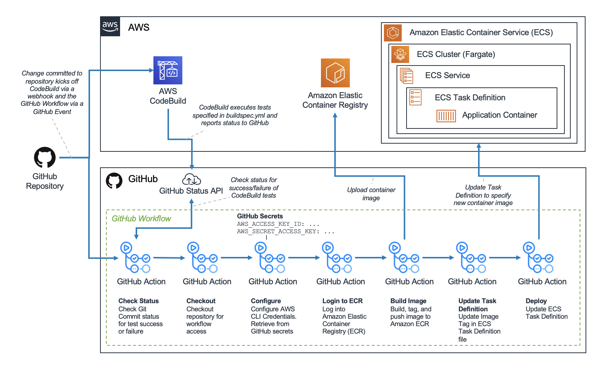

### Git Workflow with AWS ECS, AWS CodeBuild and Github Action [ref](https://aws.amazon.com/blogs/containers/create-a-ci-cd-pipeline-for-amazon-ecs-with-github-actions-and-aws-codebuild-tests/) 

- High level of Git Workflow with AWS



- Create ``buildspec.yml`` for running test
```yaml
version: 0.2
phases:
  install:
    runtime-versions:
      python: 3.8
  pre_build:
    commands:
      - pip install -r requirements.txt
      - python app_test.py
```
- Build Docker file 
```yaml
FROM python:3
# Set application working directory
WORKDIR /usr/src/app
# Install requirements
COPY requirements.txt ./
RUN pip install --no-cache-dir -r requirements.txt
# Install application
COPY app.py ./
# Run application
CMD python app.py
```
- Define task for Elastic Container Service using json file `task-definition.json`

- Use `Amazon Cloud Development Kit` to build the infrastructure

- User `CodeBuild` for workflow. It executes the `test` in the application. If the test do not pass, then it marks with ``failed`. To create `CodeBuild`, `webhooks` is used to trigger the application when there is a commit to `master` branch.

- Create Github Workflow