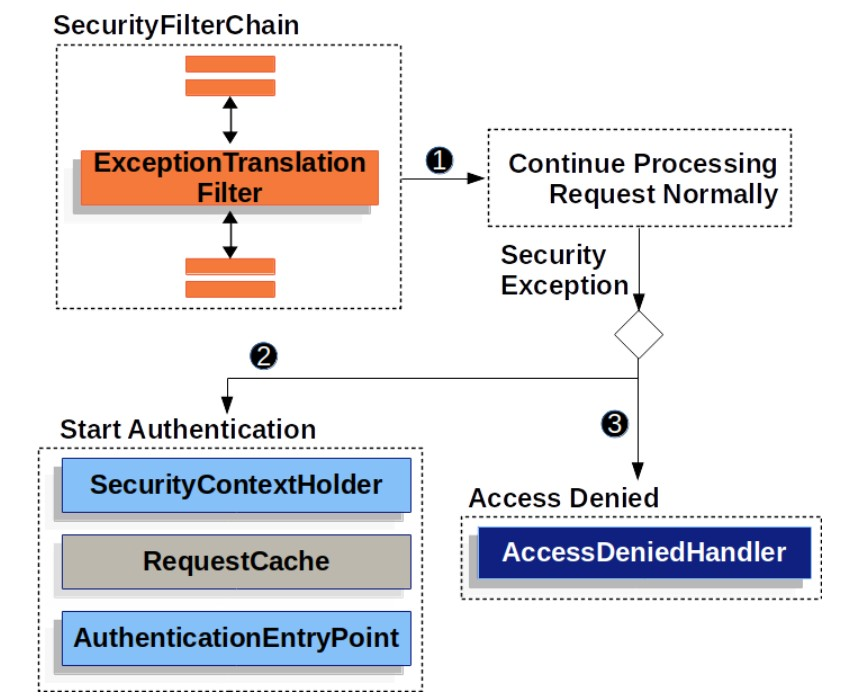
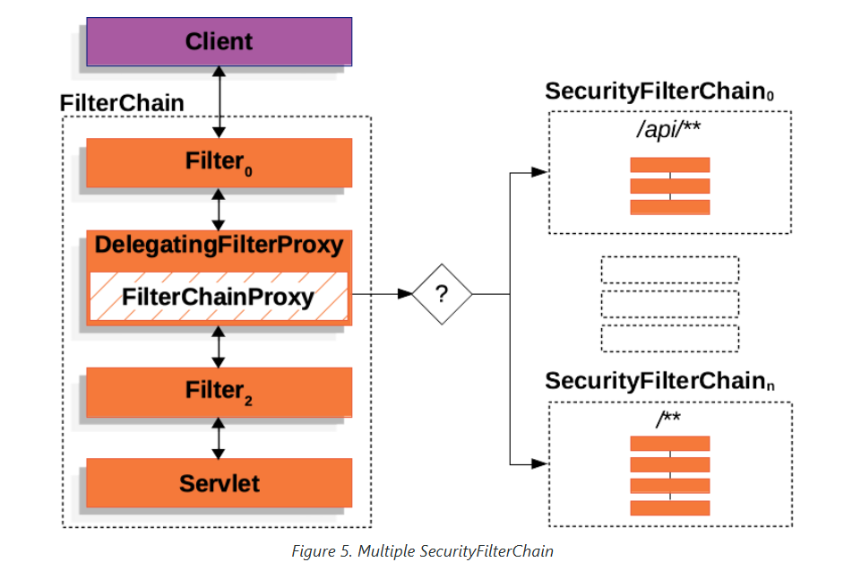

## Authentication and authorization
### Servlet Application [ref](https://docs.spring.io/spring-security/reference/servlet)
- Architecture of security 

- Exception handling

### Some references
- Simple example of Spring security for authentication and authorization [ref](https://medium.com/@victoronu/implementing-jwt-authentication-in-a-simple-spring-boot-application-with-java-b3135dbdb17b)
